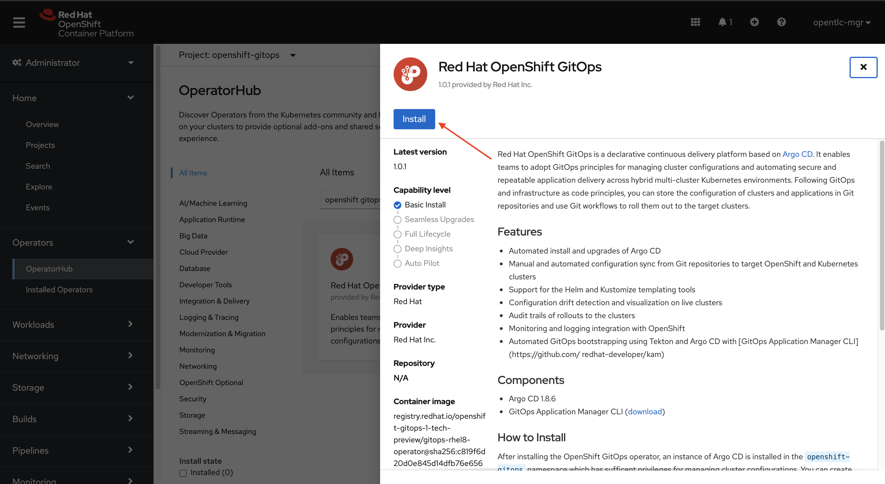
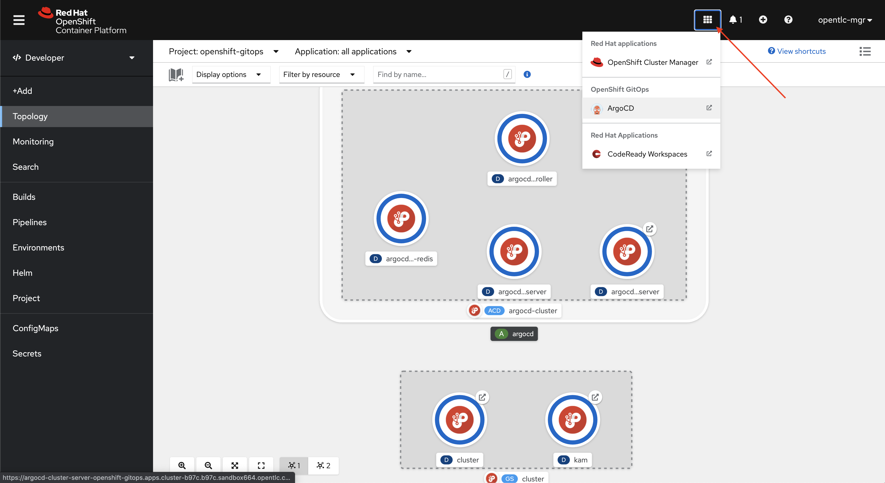

# Install the OpenShift GitOps Operator

There are two ways to install the Red Hat OpenShift GitOps operator:
* Install the Red Hat OpenShift GitOps operator using the OpenShift UI.
* Install the Red Hat OpenShift GitOps operator using the `oc` CLI.

Choose one of the following options.

## Install Using the OpenShift UI

1. Login to OpenShift as a user with *cluster admin* rights.
2. Make sure you are in the *Administration* view (top-left).
3. From the left menu, select **Operators -> OperatorHub**.
4. Search for "openshift gitops", then click on the "Red Hat OpenShift GitOps" tile.


5. Click the "Install" button on the blade that appears to the right.



6. Accept all defaults by clicking "Install" at the bottom of the screen.


## Install Using the CLI

Alternatly, you can install the OpenShift GitOps operator from the command line.

1. Using the `oc` command line interface, login to your cluster as a *cluster admin*.
2. Run the following command:

```
oc apply -k https://github.com/redhat-canada-gitops/catalog/openshift-gitops-operator/overlays/preview-4.7?ref=master
```

## What Gets Installed?

When the Red Hat OpenShift GitOps operator is installed, it will automatically do two things:

1. It will also install the latest stable version of OpenShift Pipelines (Tekton).
2. A "cluster" instance of Argo CD in the `openshift-gitops` namespace.

The "cluster" instance of Argo CD is meant for cluster administration, not for "developers" to use.  However, it can be used to create new namespaces and grant permissions to other Argo CD instances!

If you want to see what this default instance of Argo CD looks like, you can find it in the `openshift-gitops` project.  There will also be a link to this Argo CD instance automatically added to the links menu of your OpenShift UI.



The default username is `admin` and the password can be found in the `argocd-cluster-cluster` secret in the `openshift-gitops` namespace.

**Next:** [Install Argo CD for Developers](02-install-argocd.md)