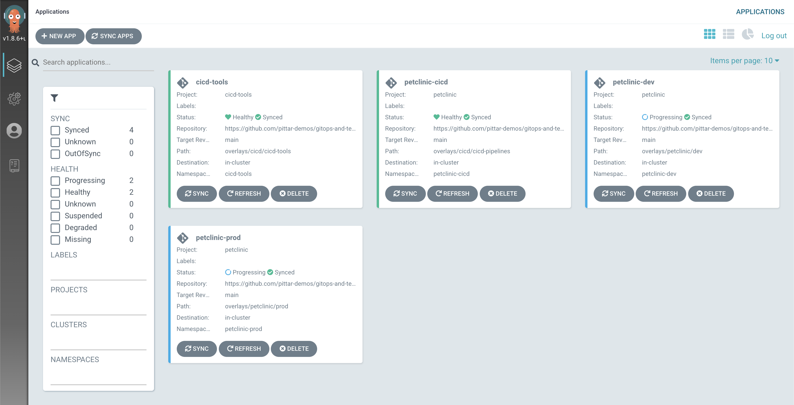

# Create Pipelines and Application Environments

With the base infrastructure in place, it's time to move on to the Pet Clinic application!

In this step we will create three new Argo CD `Applications`.
* `petclinic-cicd` - Includes a CI/CD namespace for Pet Clinic builds and build artefacts.
* `petclinic-dev` - A `petclinic-dev` project and all configuration for the **dev** Pet Clinic environment.
* `petclinic-prod` - A `petclinic-prod` project and all configuration for the **prod** Pet Clinic environment.

To begin deploying all of this, simply run the following command:

```
oc apply -k https://github.com/pittar-demos/gitops-and-tekton-with-openshift/gitops/argocd/04-petclinic
```

Once that is done, you will see the three new Argo CD `Applications` beginning to synchronize in your Argo CD UI. After a moment or two, the `petclinic-cicd` Appliaction should be healthy and green, but the `petclinic-dev` and `petclinic-prod` Applications will still by trying to progress.  It should looks like this:



This has actually done quite a bit, including:
* Creating custom Tekton *Tasks* to run maven builds, s2i builds, and tag images.
* Create a *build-and-rollout* pipeline to build the Pet Clinic from source and deploy it to the *dev* and *prod* environments.
* Create *dev* and *prod* Pet Clinic environments (`petclinic-dev` and `petclinic-prod`).

You'll notice that the "petclinic-dev" and "petclinic-prod" Argo CD projects never finish "progressing".  They might even report as "unhealthy" (red).  This is expected, since we have not yet built a Pet Clinic container image, so there is nothing to deploy!  Let's fix that...

**Next:** [Start your first Pipeline Run](05-start-pipeline-run.md)