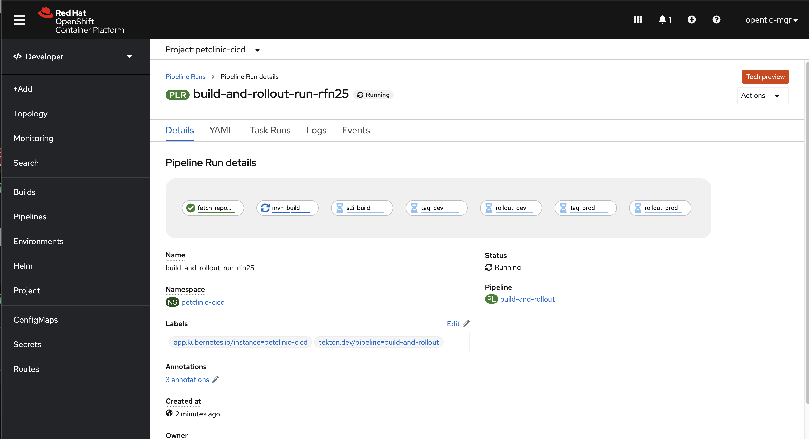
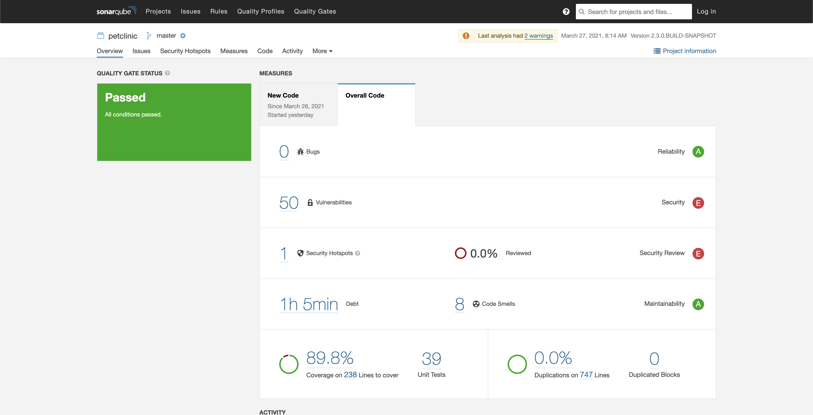

# Building and Deploying the Pet Clinic Application

Finally, it's time to use OpenShift Pipelines!

To trigger a new build, run the following command:

```
oc create -f https://raw.githubusercontent.com/pittar-demos/gitops-and-tekton-with-openshift/main/gitops/pipeline-run/build-and-rollout-pipeline-run.yaml -n petclinic-cicd
```

Now, if you switch over to the `petclinic-cicd` project in the OpenShift UI and select "Pipelines" from the left menu, you should see your first pipeline run progressing!  If you click on the pipeline run link, you will see the different tasks in the pipeline and their progress, like this:



This pipeline has a number of steps, including:
* Clone the git repository (fetch-repository).
* Build the app with Maven - including generating code quality and CVE reports to be sent to SonarQube.
* Create a new container image (s2i-build) from the binary built by Maven.
* Tag the new image as `:dev`.
* Deploy (rollout) the new image to the **dev** environment.
* Tag the image as `:prod`.
* Deploy (rollout) the new image to the **prod** environment.

Once the image has been successfully built and rolled out to **dev** and **prod**, you will notice the corresponding Argo CD *Applications* will finally finish progressing and everything should be in sync and healthy!  If not, you can manually trigger a sync on each application (although, this should resolve itself automatically within 3 minutes).

You can now take a look in both the `petclinic-dev` and `petclinic-prod` OpenShift projects to see that the application has been deployed successfully (along with MySQL databases).  You can test out each app by clicking on their respective routes and trying to add and search for pet owners.

If you swith to the `cicd-tools` project and open the SonarQube link, you will see that a project has been analyzed.


Once you are at the SonarQube UI:
1. Click on the **1** Project Analyzed (or **Projects** in the top navigation bar).


2. Click on **petclinic**.
3. Click on the "Overall Code" tab.



You can now see the results of the code and CVE analysis that was performed as part of the build.  The code coverage looks good, but there are a lot of vulnerabilities in the dependencies this application uses!  Someone should really look into that ;)


## Wrapping It All Up

As you can see, GitOps processes combined with Serverless CI can be a very powerful one-two punch.  Not only do you get the incredible consistency of having your application environments and CI pipelines versioned in git, you also have a built-in audit trail (git history) and the piece of mind knownig that your entire environment, your CI/CD tooling, and your pipelines can be quickly, consistently and easily be replicated in *any* data centre!